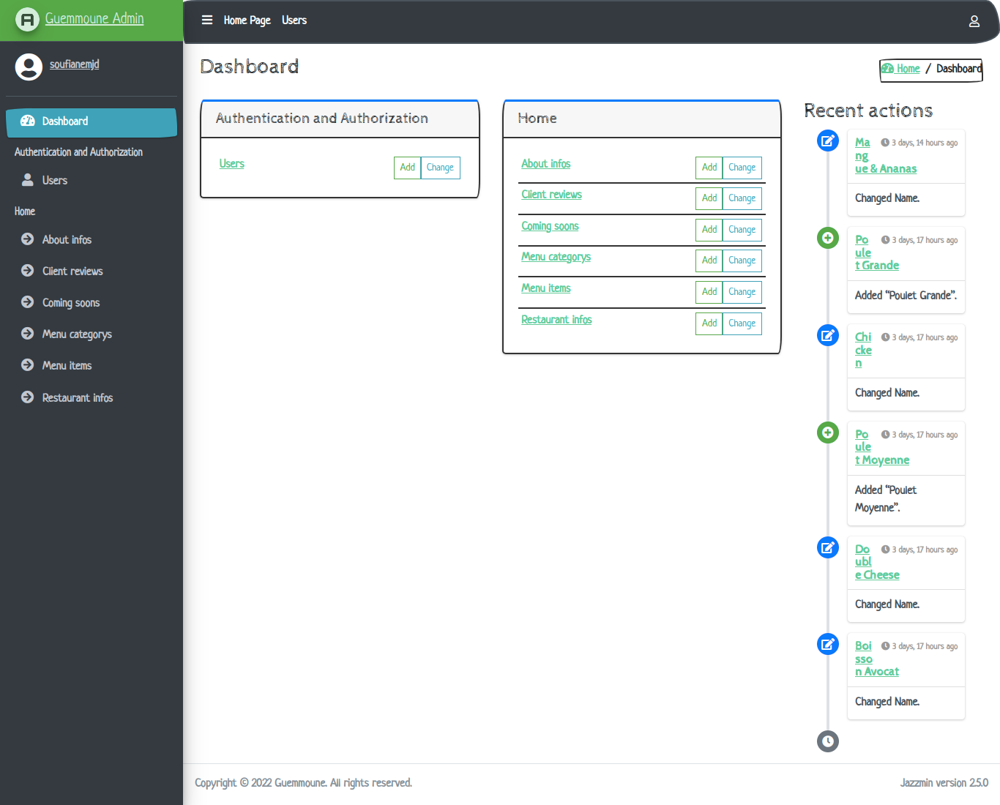
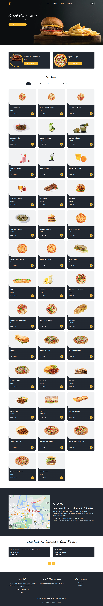
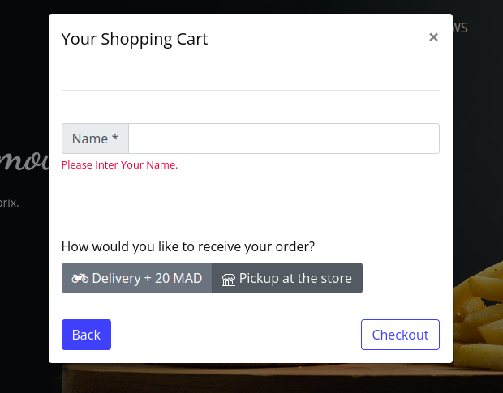
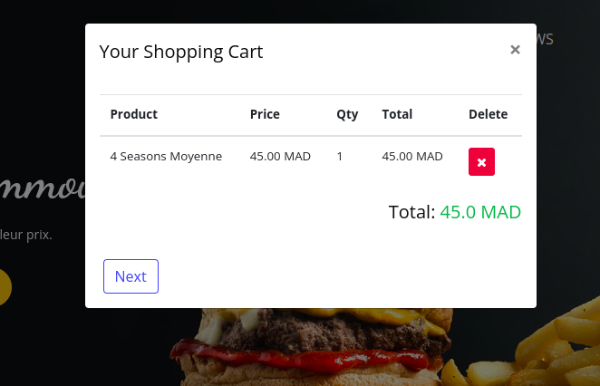
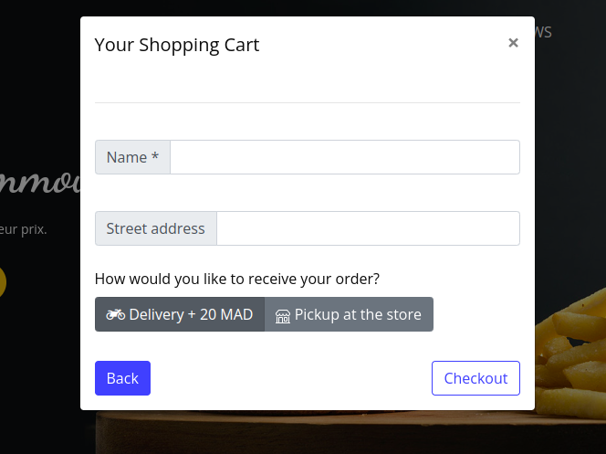
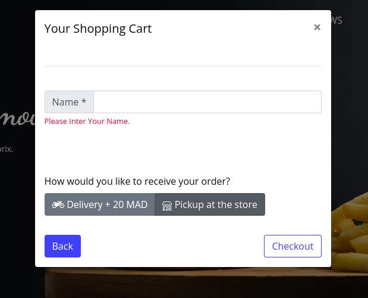
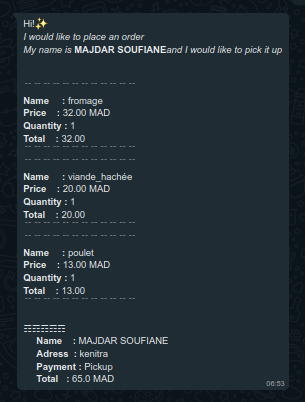

# Food_Project

The Food Project is a web application built with Django that allows users to order food online from local restaurants. The project includes a menu of available dishes from the restaurant.

On the backend, the project includes a Django admin panel that allows restaurant owners to manage their menus, view and fulfill orders, and track their sales.

The Food Project is designed to be scalable and easy to maintain, with a clean and responsive user interface that works well on both desktop and mobile devices. It is built using best practices for Django development, including object-relational mapping (ORM) to handle the interactions with the database and Django's built-in security features to protect against common web vulnerabilities.

Overall, the Food Project is a powerful and feature-rich solution for anyone looking to start an online food ordering business or add food ordering functionality to an existing website.


## Demo
https://soufianemjr.pythonanywhere.com/


## ✨ How to use it

```bash
$ # Get the code
$ git clone https://github.com/Soufiane-Majdar/Food_Project.git
$ cd Food_Project
$
$ # Virtualenv modules installation (Linux)
$ virtualenv env
$ source env/bin/activate
$
$ # Virtualenv modules installation (Windows)
$ virtualenv env
$  .\env\Scripts\activate
$
$ # Install modules (Linux)
$ pip3 install -r requirements.txt
$ # OR (Windows)
$ pip install -r requirements.txt
$
$ # creat a migration
$ python manage.py makemigrations
$ python manage.py migrate
$
$
$ # Start the application
$ python manage.py runserver 
$
$
$ # Access the web app in browser: http://127.0.0.1:8000/
```


## IMAGES

### Admin Panel
<center>
  
  <br>
</center>

### Home
<center>
  
  <br>
</center>

### Cart
<center>
  
  <br>
    
  <br>
    
  <br>
    
  <br>
</center>


### Order Message
<center>
  
  <br>
</center>
